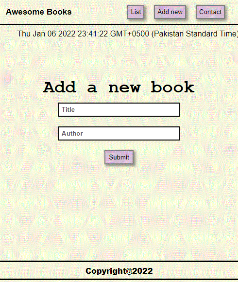
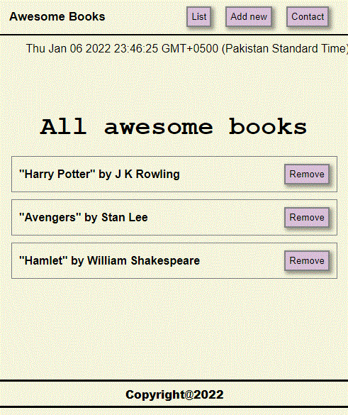
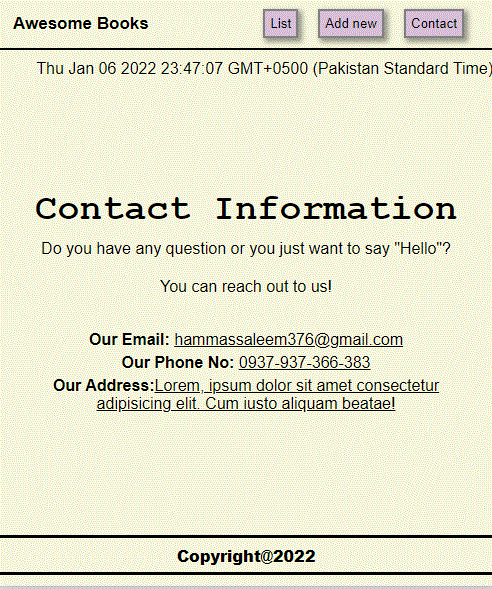

# Awesome Books

> This is an application for books record.

## Built With

- HTML
- CSS
- JavaScript

## Get Live Demo

[Live Demo Link](https://hammas-saleem.github.io/Awesome_Books)

## Authors

👤 **Akshitha Reddy**
- GitHub: [@Akshitha Reddy](https://github.com/AkshithaReddy1899)
- Twitter: [@Aksha1899](https://twitter.com/Aksha1899?t=S0sv7-gPWSxN-RzjIAz4rw&s=09)
- LinkedIn: [Akshitha Reddy](https://www.linkedin.com/in/akshitha-reddy-716944198/)

👤 **HAMMAS BIN SALEEM**
- GitHub: [@HAMMAS-SALEEM](https://github.com/HAMMAS-SALEEM)
- Twitter: [@HammasSaleem4](https://twitter.com/HammasSaleem4)
- LinkedIn: [HAMMAS SALEEM](https://www.linkedin.com/in/hammas-saleem)

## 🤝 Contributing
Contributions, issues, and feature requests are welcome!
Feel free to check the [issues page](../../issues/).

## Show your support
Give a ⭐️ if you like this project!

## Acknowledgments
- Hat tip to anyone whose code was used
- Inspiration
- etc

## 📝 License
This project is [MIT](./MIT.md) licensed.
